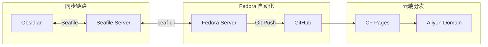

# 前言

>本来想搭建 Github Pages + NotionNext 的，在询问 Gemini 之后决定改为现在的方案
>而且 Cloudflare Pages 支持直接关联 GitHub 仓库


Gemini 给的横向对比：

| **功能特性**      | **GitHub Pages**      | **Cloudflare Pages**                 |
| ------------- | --------------------- | ------------------------------------ |
| **全栈能力**      | 仅支持纯静态（HTML/JS/CSS）   | **支持 Serverless (Functions)**，可写后端逻辑 |
| **预览功能**      | 仅主分支预览                | **PR 自动预览**（每个提交生成独立 URL）            |
| **构建速度**      | 较慢（基于 GitHub Actions） | **极快**（原生构建管道优化更好）                   |
| **带宽限制**      | 软限制 100GB/月           | **无限制 (Unlimited)**                  |
| **自定义域名**     | 支持，一个项目一个             | 支持，配置更灵活且自带 CF 加速                    |
| **安全防护**      | 基础防护                  | **顶级 WAF 防护**、防 DDoS、访问控制            |
| **Analytics** | 无（需自行集成第三方）           | **内置 Web Analytics**（保护隐私且免费）        |


具体的配置：
- Cloudflare Pages 上部署静态站
- Quartz v4 框架（原生支持Obsidian）
- Giscus 实现评论模块
- 阿里云域名（CF托管）

>不足之处：目前只能手动 Git Push 文章到仓库，之后打算使用自建 Seafile 同步笔记到本地服务器上，然后使用脚本自动 Push 到仓库

想法大概是这样：


# 部署

## 第一步：在本地初始化 Quartz 项目

根据 Quartz 官方文档，需要先安装 [Node](https://nodejs.org/) 版本 > **v22** 和 `npm` v10.9.2，这里使用的是 Win10
![[Pasted image 20260409232242.png]]
1. **克隆 Quartz 官方模板：**
    ```bash
    # 克隆到你的目录
    git clone https://github.com/jackyzha0/quartz.git
    cd quartz
    ```
2. **安装依赖：**
    ```bash
    npm install
    ```
3. **初始化项目：**
    ```bash
    npx quartz create
    ```
    
    注：在初始化时，它会问你如何处理内容，选择默认的即可  
    
1. **本地启动预览：**

	```bash
	npx quartz build --serve
	```

-   执行后，命令行会显示一个地址，通常是 `http://localhost:8080`
-   **打开浏览器访问这个地址**，如果你能看到 Quartz 的默认页面，说明你的本地环境搞定了


---

## 第二步：将项目托管到 GitHub

1. 在 GitHub 上创建一个新的**私有仓库**（比如命名为 `my-quartz-blog`）
2. 将本地代码推送到你的 GitHub 仓库：
    ```bash
    # 移除官方的 remote，添加你自己的
    git remote remove origin
    git remote add origin https://github.com/你的用户名/my-quartz-blog.git
    git branch -M main
    git add .
    git commit -m "Initial Quartz setup"
    git push -u origin main
    ```

---

## 第三步：在 Cloudflare Pages 上创建应用

1. 登录 [Cloudflare Dashboard](https://dash.cloudflare.com/)
    
2. 点击左侧的 **计算**  -> **Workers 和 Pages**
	![[Pasted image 20260409233410.png]]
3. 再点击右上角 **创建应用程序** 
	![[Pasted image 20260409233508.png]]
4. 在新页面中点击下面的小字 **开始使用**
	![[Pasted image 20260409233652.png]]
5. 在导入现有 Git 存储库这选 **开始使用**
	 ![[Pasted image 20260409233823.png]]
6. 选择你的 GitHub 账号，并选中刚才创建的 `my-quartz-blog` 仓库

> 刚关联上可能得稍等一会，我刚开始关联完之后一直跳回原来一样的的页面，无法下一步，但是过一会后就可以正常显示存储库了

7. **设置构建和部署 关键参数：**
	![[Pasted image 20260409234100.png]]
	- 框架预设：无
	- 构建命令：`npx quartz build`
	- 构建输出目录：`public`
8. 点击 **保存并部署**。

> 默认的 **Cloudflare 构建系统版本3（Build System v3）** 环境已经包含 Node.js v22.16.0 ，不用在环境变量里面指定 Node 的版本。在我的第一次尝试中，指定了和 Win10 一样的版本，在构建时报错了

---

# 移交域名

> 2026.4.12号更新：我已经切换到 Cloudflare 提供的域名，CF 自家的只用完成第一步即可

## 第一步：在 Cloudflare 中添加站点

1. 登录 [Cloudflare 控制台](https://dash.cloudflare.com/)
    
2. 点击左侧菜单的 **“站点 (Websites)”** -> **“添加站点 (Add a site)”**
    
3. 输入你在阿里云购买的域名（例如 `yourdomain.com`），选择 **Free 计划** 即可
    
4. Cloudflare 会扫描你当前的解析记录，直接点击 **“继续 (Continue)”**
    

## 第二步：前往阿里云修改 DNS 服务器（关键）

Cloudflare 会给你两个 **名称服务器 (Nameservers)**，例如：

- `ashley.ns.cloudflare.com`
    
- `brad.ns.cloudflare.com`

如果你已经点击了“添加站点”并输入了域名：

1. 在首页的**站点列表**中，点击你刚才添加的那个域名（此时状态应该是“待定名称服务器更新”）
    
2. 进入后，你会直接看到一个大框，写着 **“完成名称服务器设置”**
    
3. 在页面下方，你会看到类似这样的两行（这就是你要填到阿里云的）：
    
    - `xxx.ns.cloudflare.com`
        
    - `yyy.ns.cloudflare.com`

4. 打开 [阿里云域名控制台](https://dc.aliyun.com/)
    
5. 找到你的域名，点击 **“管理”**
    
6. 在左侧菜单选择 **“DNS 修改”** -> **“修改 DNS 服务器”**
    
7. 将阿里云原有的 DNS 地址删除，换成 Cloudflare 提供的这两个地址
    
8. **等待生效：** DNS 修改可能需要几分钟到几小时不等（通常 10 分钟内生效）。Cloudflare 状态变为“已激活”后会有邮件通知
    

## 第三步：在 Pages 项目中绑定自定义域名

1. 回到 Cloudflare 控制台，点击左侧 **“Workers 和 Pages”**
    
2. 选择你的 **`my-quartz-blog`** 项目
    
3. 点击上方的 **“自定义域 (Custom domains)”** 选项卡
    
4. 点击 **“设置自定义域 (Set up a custom domain)”**
    
5. 输入你的域名（比如 `blog.yourdomain.com` 或者根域名 `yourdomain.com`）
    
6. 点击 **“继续”**，Cloudflare 会自动帮你添加一条 CNAME 记录
    
7. 点击 **“激活域”**

修改完后，你在 Windows 的终端（CMD 或 PowerShell）里输入以下命令，如果看到返回的是 Cloudflare 的地址，就说明成功了：

```bash
nslookup -qt=ns 你的域名
```

# 添加评论功能

> 我是直接跟着[Quartz Comments 教程](https://quartz.jzhao.xyz/features/comments)走的，不想重新在这写一遍了

# 自动同步功能

逐步实现中